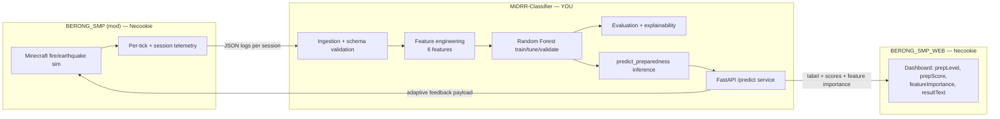

# MiDRR-Classifier — AI/ML Engineer Development Plan

**Project:** *Minecraft as a Platform for AI-Enhanced Disaster Risk Simulation and Adaptive Educational Preparedness* (BERONG SMP)
**Your role:** AI/ML Engineer — own the feature pipeline, Random Forest model, evaluation, explainability, and the inference/serving boundary.
**Primary repo:** [`Kiko915/MiDRR-Classifier`](https://github.com/Kiko915/MiDRR-Classifier)
**Downstream consumers:** [`Necookie/BERONG_SMP_WEB`](https://github.com/Necookie/BERONG_SMP_WEB) (landing + dashboard), `Necookie/BERONG_SMP` (Minecraft mod/server — private)
**Companion docs (same `docs/` folder):** `telemetry_contract.md` (v1.1 — mod↔ML data spec) · `labeling_rubric.md` (how `y` labels are produced)

> Anchor the week numbers below to your real academic calendar (defense date, data-collection windows). They are relative durations, not fixed dates.

> **Updated** after the system architecture diagram and the BFP-validated LSPU Sta. Cruz evacuation plan were added. Key deltas: labeling rubric now exists and is grounded in the BFP plan; telemetry contract bumped to v1.1 (three new events + map metadata); PostgreSQL confirmed as the data-layer store; feature importance confirmed to feed the stealth-assessment layer.

---

## 0. Read this first — the two things that decide your whole timeline

Before any modeling, two facts from the actual repos govern everything:

### 0.1 The telemetry gap (your critical path, and it's not in your repo)
Your `data_schema.RAW_LOG_SCHEMA` and Chapters 1 & 3 assume **per-event/per-tick logs** — `x/y/z`, `timestamp`, `hazard_distance` over time, and interaction events (`door_open`, `extinguisher_use`, `emergency_exit`). All six of your engineered features are computed from that granularity.

But per `BERONG_SMP_WEB/CLAUDE.md`, the mod **currently emits session-level data only**:

| The mod produces today | Your six features need |
|---|---|
| `disasterType` (FIRE/EARTHQUAKE) | per-tick `x,y,z` trajectory → `path_efficiency_ratio`, `panic_proxy` |
| session duration / ticks elapsed | `timestamp` per event → `evacuation_time`, `decision_delay` |
| `firesExtinguishedCount` (fire) | timestamped interaction events → `interaction_frequency`, `decision_delay` |
| `magnitude`, `aftershockCount`, `EarthquakePhase` (quake) | `hazard_distance` per tick → `hazard_avoidance_ratio` |
| player UUID, start/end | — |

**Implication:** none of your six features can be computed from real data until the mod ships new per-tick instrumentation. This is a **cross-repo dependency on Necookie**, and it is the single longest pole. Your `data_schema.py` already *is* the contract — your first high-leverage move is to formalize it as a logging spec and hand it over.

> **Now formalized** as `docs/telemetry_contract.md` (v1.1). The BFP evacuation plan added three required events the mod must build beyond the six-feature stream: `fire_alarm_activate` (COMMUNICATE step), `assembly_area_reached` (the *true* evacuation-success signal — not `emergency_exit`), and `nearby_player_count` on `extinguisher_use` (the "do not fight fire alone" rule). It also adds a one-time static `map_metadata.json` (designated exits, assembly areas, alarm/extinguisher positions) so `path_efficiency_ratio` measures against the real floor plan.

### 0.2 The labeling problem (no ground truth exists yet)
Random Forest is **supervised** — it needs labeled `preparedness_level` per run. Nothing in either repo produces those labels yet, and Chapter 2 itself argues preparedness is *behavioral, not knowledge-based*, so you cannot just use a quiz score as the label without weakening construct validity. You must decide the labeling strategy **before** collecting data, because it shapes the consent forms, the rubric, and the experimental protocol. See §3.

> **Now addressed** by `docs/labeling_rubric.md` — an expert-rubric + rule-based hybrid grounded in the BFP-validated LSPU evacuation plan (PASS, ISOLATE→COMMUNICATE→EVACUATE→RECORD, assembly-area success). It includes a **circularity/label-leakage guard** (don't let raters score the same quantities the model uses as features) and a critical-failure override (unsafe outcome caps at Low regardless of speed/calm).

> These two items are also the honest answer to your adviser's Chapter 2 comment (*"nasan ang basis like supporting articles"*) on the Algorithm Matrix: the basis for RF is in your lit review (Fife & D'Onofrio 2023; Wu & Jiang 2024; Chen 2022), but the basis for *your labels and features* must be made explicit in Chapter 3.

---

## 1. Scope boundary — what is yours vs. not

**Yours (own end to end):** §C–H above — ingestion, features, model, evaluation, explainability, the inference function, and the serving API.
**Shared/negotiated:** the telemetry contract (§0.1) and the adaptive-feedback payload schema (§9).
**Not yours:** mod gameplay logic, the dashboard UI, auth. You *specify* what you need from them; you don't build it.

---

## 2. Repo readiness — where MiDRR-Classifier actually stands

Good news: the scaffold is solid and well-aligned to Chapter 3. Honest status:

| Module | State | What's left |
|---|---|---|
| `config.py` | ✅ real | tune `n_estimators`, `max_depth` after CV; add `feedback`/serving knobs |
| `data_schema.py` | ✅ real | promote to a versioned **logging contract**; calibrate `SAFE_HAZARD_DISTANCE`; lock `LABEL_CLASSES` casing (note: schema uses `High/Moderate/Low`, dashboard uses `HIGH/MODERATE/LOW` — **reconcile this now**) |
| `data_ingestion.py` | ✅ real | add stratified split, group-aware split by `player_id` |
| `feature_engineering.py` | ⚠️ **placeholder formulas** | replace all `compute_*` with Chapter-3-exact operational definitions |
| `model_definition.py` | ✅ real wrapper | add `predict_proba`, class-weight, CV helper |
| `train.py` / `evaluate.py` | ✅ runnable | wire CV, persist metrics JSON, save importances |
| `inference.py` | ✅ boundary defined | add proba + per-feature importance to the return; this feeds the dashboard's `prepScore` + `featureImportance` |
| `tests/` | ✅ synthetic-data tests pass | add tests for label casing, group split, API contract |
| **REST API** | ❌ not built | `midrr-api` FastAPI service (the web repo already expects `PUBLIC_API_BASE_URL`) |
| **Dataset** | ❌ none | blocked on §0.1 |

**Quick win this week:** the casing mismatch (`High` vs `HIGH`) will silently break the dashboard integration. Pick one canonical form, fix `LABEL_CLASSES`, and add a test that asserts it. Small, but it's a real latent bug across repos.

---

## 3. Labeling strategy — decide before collecting data

You need ordinal labels (`High`/`Moderate`/`Low`) per run. Three viable routes; you most likely want the **hybrid**:

| Route | How | Strength | Weakness |
|---|---|---|---|
| **A. Expert-rubric (recommended gold standard)** | BFP officers / teachers (already your Ch3 stakeholders) score each session against a fixed disaster-response rubric → ordinal label | High construct validity; ECD-aligned; defensible at defense | Labor-intensive; needs **inter-rater reliability (Cohen's/Fleiss' κ)** |
| **B. Rule-based weak labels** | Threshold rules on raw outcomes (e.g. evacuated in time + low hazard exposure → High) | Scales to all sessions; cold-start friendly | Circular if rules ≈ features; must be validated against A |
| **C. Pre/post knowledge test as proxy** | Use test gain as the label | Cheap | Weak — contradicts your own Ch2 "behavior ≠ knowledge" argument; use only as a secondary criterion variable, not the primary label |

**Recommended:** Expert-rubric on the **full set if feasible, or a gold subset**, plus rule-based weak labels to scale, with the rule-based labels **validated against the expert gold set** (report agreement). Report κ in Chapter 3/4. This directly hardens the methodology against the "where's the basis" critique.

**Status — DONE:** this strategy is now fully specified in `docs/labeling_rubric.md`, grounded in the BFP-validated LSPU evacuation plan. It defines the six scoring dimensions per scenario, the composite→level tiers, the critical-failure override, the κ protocol, the `label_source` (`expert`/`rule`) separation, and the circularity guard. **Remaining action:** get BFP/DRRMO to validate the *earthquake* dimensions (the uploaded plan is fire-focused) and run the rater-calibration pilot.

---

## 4. Development lifecycle (phased)

The ordering is deliberate: everything you *can* do without real data is front-loaded, so you're not idle while the mod telemetry and data collection happen in parallel.

### Phase 0 — Foundations & decisions *(do now, ~1 wk)*
- [ ] Reconcile label casing across `data_schema.py` ↔ dashboard `PrepLevel`. Add a test.
- [ ] Lock the **operational definitions** of all six features to exact Chapter 3 wording (units, edge cases, time caps). Write them into `data_schema.py` docstrings as the source of truth.
- [ ] Decide labeling strategy (§3) and draft the rubric + κ protocol.
- [ ] Freeze the **telemetry contract v1** (next phase) from your `RAW_LOG_SCHEMA`.

### Phase 1 — Synthetic data + pipeline hardening *(parallel, ~1–2 wks, no real data needed)*
- [ ] Write a **synthetic log generator** that emits the exact `telemetry_contract.md` v1.1 format (including `fire_alarm_activate`, `assembly_area_reached`, `nearby_player_count`) for fire and earthquake, with controllable "skill" so it produces separable High/Moderate/Low. Put it in `src/midrr_classifier/synth.py` and a notebook.
- [ ] Replace placeholder `compute_*` formulas with the locked Chapter-3 definitions; verify against synthetic ground truth. **Two semantics fixes from the BFP plan:** (a) `evacuation_time`/`decision_delay` end at `assembly_area_reached`, **not** `emergency_exit` (an exit is a waypoint); (b) `interaction_frequency` is **not** monotonically good — extinguisher use while `nearby_player_count == 0` is a *violation*, so don't treat all interactions as positive signal.
- [ ] End-to-end smoke run: raw → features → train → evaluate → confusion matrix PNG, **entirely on synthetic data**.
- [ ] Group-aware, stratified train/test split (never let one `player_id` leak across splits).
- [ ] CI: GitHub Actions running `pytest` on push.
- [ ] **Label all synthetic outputs clearly as synthetic** (the web CLAUDE.md insists on this separation; mirror it).

### Phase 2 — Telemetry contract (cross-repo) *(blocks real data; start ASAP)*
- [x] Turn `RAW_LOG_SCHEMA` into a versioned **`docs/telemetry_contract.md`** — **DONE (v1.1)**: JSON + batch-CSV shapes, per-tick vs per-event, 10 Hz sampling, coordinate frame, units, full `event_type` vocabulary.
- [x] Specify required new mod instrumentation — **DONE** (§7 gap analysis): per-tick `x,y,z`; running `hazard_distance`; `fire_alarm_activate`; `assembly_area_reached`; `nearby_player_count`; one-time `map_metadata.json`.
- [ ] **Hand to Necookie with a deadline (your single highest-leverage action — do today).** Track it as a cross-repo dependency.
- [ ] Agree on transport: the architecture diagram shows the data layer as **Real-Time Logging → PostgreSQL → Feature Engineering**, so the mod can write to Postgres and your `data_ingestion.py` reads from it directly (add a Postgres loader alongside the CSV loader). Batched CSV export remains the lower-risk fallback for a thesis.

### Phase 3 — Real data collection *(blocked on Phase 2; ~2–4 wks of runs)*
- [ ] Pilot: small N first to validate that logs match the contract and features compute sanely.
- [ ] Capture expert-rubric labels alongside each run (your raters watching/replaying sessions).
- [ ] Inter-rater reliability pass; resolve disagreements; compute κ.
- [ ] Full data-collection runs (Santa Cruz / Calamba sites per Ch3).
- [ ] Version raw data (consider DVC — already a TODO in your README).

### Phase 4 — Feature engineering on real data *(~1 wk)*
- [ ] Run real logs through the pipeline; inspect distributions per feature per class.
- [ ] Calibrate `SAFE_HAZARD_DISTANCE` and any thresholds with domain experts (currently a hardcoded `5.0` TODO).
- [ ] Handle real-world mess: missing ticks, players who never evacuate, scenario time-limit caps.
- [ ] EDA: per-class feature separability, correlations (matters for importance interpretation later).

### Phase 5 — Model training, tuning, validation *(~1–2 wks)*
- [ ] Baseline RF with defaults → record metrics as the floor.
- [ ] **Stratified k-fold CV (k=5)** — report **mean ± std**, not a single split (your N is small: ≤300–400 students, fewer complete sessions, 2 scenarios → high variance risk).
- [ ] Hyperparameter search (`n_estimators`, `max_depth`, `min_samples_leaf`, `max_features`, `class_weight`) via grid/random search inside CV.
- [ ] Address class imbalance (`class_weight="balanced"` and/or resampling) — preparedness classes will not be even.
- [ ] Lock final config into `config.py`; retrain on full train split; persist `models/midrr_rf.pkl`.

### Phase 6 — Evaluation & explainability *(~1 wk)*
- [ ] Report accuracy, **per-class** precision/recall/F1 (macro + weighted), confusion matrix — all six are explicit Chapter 1/3 objectives.
- [ ] **Feature importance: use permutation importance and/or SHAP**, not just sklearn's default Gini `feature_importances_`. Two reasons: (a) Gini importance is biased for correlated features (your features *are* correlated), (b) the dashboard's mock already expects *"Shapley-value-like weight 0.0–1.0"* in `featureImportance` — so SHAP is the natural fit and gives you the dashboard integration for free.
- [ ] **Compute SHAP per-session, not only globally.** The architecture diagram routes Feature Importance into the Stealth-Assessment layer, which turns it into adaptive feedback — so each run needs its *own* top-contributing features, not just a dataset-wide ranking.
- [ ] Persist all metrics to a `models/metrics.json` so figures regenerate deterministically for the manuscript.
- [ ] Sanity check importances against domain intuition (e.g. `decision_delay`, `hazard_avoidance_ratio` should rank high) — this *is* your "what behaviors drive preparedness" research finding.

### Phase 7 — Serving / API *(~1 wk; the web repo already expects it)*
- [ ] Build `midrr-api` (FastAPI): `POST /predict` taking the six features (or raw session logs → features → predict).
- [ ] Return `{ prepLevel, prepScore (proba→0–100), featureImportance[], resultText }` — matches the dashboard `Session` contract exactly.
- [ ] Add `POST /leads` and pre/post survey endpoints **only if** your team decides surveys flow through this API (web repo references them as design intent).
- [ ] Containerize; deploy somewhere free/cheap (Render free tier with an UptimeRobot keep-alive is fine for a thesis demo — same pattern you've used before; Railway or a small VPS if you want no cold starts).
- [ ] Set `PUBLIC_API_BASE_URL` in the web repo to your deployed URL.

### Phase 8 — Adaptive feedback (ECD / stealth-assessment layer) *(~1 wk)*
- [ ] Map predicted level + top feature contributions → human-readable `resultText` and improvement recommendations (this is the "adaptive feedback" objective and the ECD competency-evidence link).
- [ ] Keep it rule-driven and explainable (e.g. "high `decision_delay` + low `hazard_avoidance_ratio` → recommend X"). Defensible and doesn't need another model.
- [ ] Define the feedback payload the mod consumes (cross-repo with Necookie).

### Phase 9 — Manuscript & defense support *(ongoing → final)*
- [ ] Generate publication-quality figures: confusion matrix, feature-importance bar, per-class metrics table, CV variance.
- [ ] Write the results narrative for Chapter 4 (model performance, which behaviors mattered).
- [ ] Prepare a reproducibility appendix: seeds, config, env (`requirements.txt`), data version.
- [ ] Defense Q&A prep: *why RF over alternatives* (your Algorithm Matrix), *why these features*, *how you got labels and their reliability (κ)*, *small-N generalization limits*.

---

## 5. Task → manuscript mapping

| Manuscript element | Phase / artifact that satisfies it |
|---|---|
| Ch1 obj: structured data logging architecture | §2 telemetry contract + `data_schema.py` |
| Ch1 obj: train & validate RF on behavioral features | Phases 4–5 |
| Ch1 obj: ECD stealth assessment + adaptive feedback | Phase 8 |
| Ch1 obj: accuracy/precision/recall/F1/confusion/importance | Phase 6 + `metrics.json` |
| Ch2 adviser comment ("basis…") on Algorithm Matrix | §3 labeling basis + §4 Phase 9 defense notes; cite Fife & D'Onofrio, Wu & Jiang, Chen |
| Ch3 Granular Logging Framework (Table 1) | §0.1 / §2 — reconcile your 6 features with Table 1's 8 attributes (Table 1 adds `Decision Sequence`, `Task Completion Time`, `Safety Compliance` — decide if these become features or stay raw) |
| Ch3 70/30 split + K-fold | Phase 5 (use grouped, stratified CV) |
| Ch3 System Architecture (Data/ML/Assessment layers) | Phases 1–8; architecture diagram **confirms PostgreSQL** as the data-layer store (Real-Time Logging → Postgres → Feature Engineering) and routes **Feature Importance → Stealth Assessment**. Add a Postgres loader to `data_ingestion.py`; compute SHAP per-session for the feedback layer |

> ⚠️ **Consistency fix for Ch3:** Table 1 lists **8** logged attributes but your model uses **6** engineered features. State explicitly which raw attributes map to which features, and whether `Decision Sequence`, `Task Completion Time`, and `Safety Compliance` are (a) additional features, (b) raw inputs to existing features, or (c) out of scope. Examiners will catch a 6-vs-8 mismatch.

---

## 6. Risks & mitigations

| Risk | Likelihood | Mitigation |
|---|---|---|
| Mod telemetry never reaches required granularity | **High** | Lock contract early (§2); have a fallback reduced feature set computable from session-level data only, so you can still ship *something* |
| Small N → overfitting, unstable metrics | High | Grouped stratified k-fold, report mean±std, prefer shallower trees, `class_weight=balanced`, permutation importance |
| Label quality / rater disagreement | Med | Rubric + κ; resolve via adjudication; report reliability |
| Label casing / schema drift across repos | Med | Single versioned contract; contract tests in CI |
| Correlated features inflate Gini importance | Med | SHAP / permutation importance |
| Scope creep into mod/dashboard work | Med | Hold the §1 boundary; specify, don't build, others' parts |
| **Your known pattern: motivation fading ~week 2, projects unfinished** | — | Define "done" per phase on day one (§7); ship the synthetic-data end-to-end pipeline *first* so you always have a working, demoable system even if real data slips |

---

## 7. "Done" criteria (define the finish line now)

The ML component is **defense-ready** when:
1. The full pipeline runs raw logs → features → trained model → evaluation **on real, labeled data** with one command.
2. Reported metrics use grouped stratified CV with mean ± std, plus a held-out confusion matrix.
3. Feature importance (permutation/SHAP) is computed, plotted, and interpreted against domain expectation.
4. `predict_preparedness` is wrapped in a deployed `/predict` API returning the dashboard's exact contract.
5. Adaptive feedback maps predictions → explainable recommendations.
6. Labeling reliability (κ) is reported; feature/label definitions match Chapter 3 verbatim.
7. Everything reproduces from `requirements.txt` + fixed seed + a versioned dataset.

A *minimum viable* version (so you're never stuck with nothing): items 1–3 on **synthetic** data. Build that in Phase 1 and you have a working system to demo regardless of mod/data delays.

---

## 8. Immediate next actions (this week)

Done since first draft: ~~write the telemetry contract~~ (✅ v1.1) · ~~draft the labeling rubric + κ protocol~~ (✅ `labeling_rubric.md`). Remaining:

1. **Commit the three `docs/` files and send `telemetry_contract.md` to Necookie with a deadline** — the clock-starter on the longest pole. Do this first.
2. Fix the `High`/`HIGH` label casing across repos + add a test.
3. Lock the six feature operational definitions to Chapter 3 wording in `data_schema.py` (apply the two BFP semantics fixes: assembly-area = success; extinguisher-while-alone ≠ good).
4. Resolve the Chapter 3 **6-features-vs-8-attributes** mapping with your team.
5. Build `synth.py` (emitting contract v1.1) + run the full pipeline end-to-end on synthetic data (your MVP safety net).
6. Get BFP/DRRMO to validate the **earthquake** rubric dimensions.

---

*Plan generated from your three repos and Chapter 1–3 drafts. Re-anchor phase durations to your defense calendar.*
