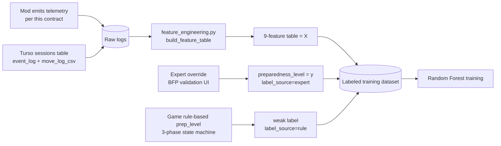

# BERONG SMP — Telemetry Contract

**Version:** 1.2 (draft)
**Owner:** AI/ML Engineer (MiDRR-Classifier)
**Implementer:** Mod/Server team (BERONG_SMP) + web team (BERONG_SMP_WEB, for the Turso `sessions` table)
**Status:** Proposed — fields below are what the ML pipeline *requires*; several do not exist in the mod yet (see §7).

This document defines the exact data the Minecraft mod must emit so the MiDRR-Classifier can compute its 9 features and train the preparedness model. It is the single source of truth for the mod↔ML boundary. If a field changes here, bump the version and notify both sides.

> **Important:** This telemetry is **not** the training dataset. It is the raw input. The ML pipeline turns these logs into engineered features, and labels are attached separately (expert override, or the game's own rule-based `prep_level` as a weak label — see `docs/labeling_rubric.md` §7). The mod never emits an expert `preparedness_level`.

### Changes since v1.1 (driven by the 2026-07-01 BFP consultation & revised simulation design)
- **9 features, not 6.** `decision_delay` → `decision_latency` (re-anchored to `session_start`, not first hazard exposure). Three new features: `spray_accuracy`, `resource_utilization`, `situational_awareness`. `panic_proxy` redefined from bearing-change std-dev to movement-speed² std-dev. Earthquake gets a full parity computation for every feature (see §4a).
- **New events for the 3-phase fire state machine:** `ext_spray` (carries `hit_fire`, `extinguisher_class`), `pin_pull`, `hazard_neutralize`, `phase_transition` (carries `phase` ∈ `prevention`/`intervention`/`evacuation`).
- **New event for earthquake:** `drop_cover_hold` — the Duck/Cover/Hold analog of taking a safety interaction.
- **`extinguisher_class` field** on extinguisher events — must match the room's correct class (Lab → CO₂, Cafeteria → Dry Powder, Classroom → ABC) for `resource_utilization`/`spray_accuracy` to score PASS technique as correct.
- **New transport: Turso Cloud DB (libSQL).** The web team's `sessions` table (student_name, simulation_type, simulation_score, passed, event_log JSON, move_log_csv, prep_level, confidence) is now a first-class ingestion source alongside batched CSV — see §3b. The ML repo's ingestion adapter reads either.
- **Game-computed `prep_level` is now real input**, not just an ML output. The 3-phase state machine scores its own rule-based prep_level (≥75 HIGH / 40–74 MODERATE / <40 LOW) and writes it to the `sessions` row as a `label_source="rule"` weak label. BFP-instructor overrides in a validation UI write `label_source="expert"` (gold; the only source allowed in the test split — see `labeling_rubric.md`).
- **Sampling-rate inconsistency resolved:** locked to **20 Hz** (every native Minecraft tick) everywhere in this document — see §2. (v1.1 had a stray "confirm 10 Hz" open question that contradicted the 20 Hz requirement stated elsewhere; `synth.py` must be updated to match in Phase 2.5 step 5.)

Carried over from v1.0→v1.1 (still in force): `fire_alarm_activate` (COMMUNICATE step), `assembly_area_reached` (true evacuation success, not `emergency_exit`), `nearby_player_count` on extinguisher events ("DO NOT FIGHT FIRE IF ALONE"), and `map_metadata.json` (§8).

---

## 1. What the data is used for (why each side should care)



Every required field below maps to at least one model feature or rubric dimension. If the mod cannot emit a field, the dependent feature/score is uncomputable.

---

## 2. Scope, units, and conventions

| Convention | Value |
|---|---|
| Coordinate frame | Minecraft world coordinates. **X, Z = horizontal plane; Y = vertical (height).** |
| Distance unit | Minecraft blocks (1 block = 1 meter, treat as float) |
| Time anchor | `t = 0.0` is **`SIM_START`** — the `session_start` event fired at the disaster trigger tick (fire ignition / quake onset), **not** world join. Pre-trigger samples may be logged with negative `t` or omitted — see §6. All 9 features that measure elapsed time (`decision_latency`, `evacuation_time`) anchor from `SIM_START`. |
| Time unit | Seconds since trigger, float. Minecraft runs at 20 ticks/sec, so `seconds = tick_count / 20.0`. |
| Sampling rate (movement) | **Locked at 20 Hz** (every tick — matches Minecraft's native tick rate). This is required, not a target — do not sample below this rate; the real-time streaming design (§6) assumes it. `synth.py` must emit at 20 Hz to stay representative (Phase 2.5 step 5). |
| Events | Logged the instant they happen (not sampled). |
| `scenario_type` values | Four distinct canonical values: `fire`, `earthquake`, `ccs_fire`, `ccs_earthquake`. `ccs_*` = CCS Admin Building; `fire`/`earthquake` = Library Building. **Do NOT collapse** — different buildings have different assembly zones and room layouts. Match the database `simulation_type` enum in lowercase. |
| Sim phases | Fire scenarios run a 3-phase state machine: `prevention` → `intervention` → `evacuation`, emitted via `phase_transition` events. The game's own rule-based `prep_level` is partly derived from which phase the player reached and how (see `labeling.py::phase_outcome_label()`). |
| Player identity | Emit a stable `player_id` (UUID or pseudonymized ID). One value per student for the whole study so labels and sessions join correctly. |
| Character encoding | UTF-8, no BOM. |

---

## 3. Transport — two supported sources (Phase 2.5 ingestion adapter)

`data_ingestion.load_sessions(source=...)` accepts either transport below and normalizes both into the same long-format raw-log rows validated by `validate_raw_schema()`.

### 3a. Batched CSV (offline / reproducibility)

One **long-format CSV per data-collection batch**, one row per logged sample **or** event. This matches `MiDRR-Classifier/src/midrr_classifier/data_schema.RAW_LOG_SCHEMA` and feeds `build_feature_table()` directly (grouped by `player_id` × `scenario_type`).

**File:** `gameplay_logs_<batch>_<YYYYMMDD>.csv`

| Column | Type | Required | Description | Example |
|---|---|---|---|---|
| `player_id` | string | ✅ | Stable per-student identifier | `stu_0412` |
| `session_id` | string | ✅ | Unique per run (one student can have multiple runs) | `sess_a91f` |
| `scenario_type` | string | ✅ | `fire`, `earthquake`, `ccs_fire`, or `ccs_earthquake` | `fire` |
| `timestamp` | float | ✅ | Seconds since `SIM_START` (`t=0` at trigger) | `12.40` |
| `event_type` | string | ✅ | See §4 vocabulary (`EVENT_TYPES` in `data_schema.py`) | `move` |
| `x` | float | ✅ on `move` | Horizontal X | `124.5` |
| `y` | float | ✅ on `move` | Vertical (height) | `64.0` |
| `z` | float | ✅ on `move` | Horizontal Z | `-88.2` |
| `hazard_distance` | float | ✅ on `move`/`hazard_proximity` | Distance (blocks) to **nearest active hazard** at that instant | `7.30` |
| `nearby_player_count` | int | ✅ on `extinguisher_use`/`ext_spray`/`pin_pull` | Other players within ~5 blocks / same room at the event (for the "do not fight fire if alone" rule) | `0` |
| `hit_fire` | bool (0/1) | ✅ on `ext_spray` | Did the spray connect with an active hazard tile? Drives `spray_accuracy` | `1` |
| `extinguisher_class` | string | ✅ on `ext_spray`/`pin_pull` | `CO2` / `DRY_POWDER` / `ABC` — checked against the room's correct class | `CO2` |
| `phase` | string | ✅ on `phase_transition` | `prevention` / `intervention` / `evacuation` | `intervention` |
| `interaction_target` | string | optional | What was interacted with, for context | `extinguisher_03` |

> **Movement rows carry `hazard_distance`.** The cheapest implementation: on every sampled `move` row, also compute and attach the current nearest-hazard distance. Then you don't need separate `hazard_proximity` rows at all (keep that event_type optional).

`preparedness_level` is **deliberately absent** from the raw CSV — it is joined in later, either from the labeling spreadsheet (`label_source="expert"`) or from the game's rule-based `prep_level` (`label_source="rule"`), keyed on `session_id`.

### 3b. Turso Cloud DB (libSQL) — live source

The web team's `sessions` table is now a first-class source. The ML ingestion adapter reads it directly (`config.turso_database_url` / `turso_auth_token`, env-configured) and unpacks it into the same raw-log rows as §3a.

| `sessions` column | Type | Maps to |
|---|---|---|
| `session_id` | string (PK) | `session_id` |
| `student_name` | string | `player_id` (pseudonymize if this is a real name) |
| `simulation_type` | string | `scenario_type` |
| `event_log` | JSON array | exploded into one raw-log row per array element (each element carries `event_type`, `timestamp`, `x`/`y`/`z`, and the event-specific fields from §3a) |
| `move_log_csv` | string (embedded CSV) | parsed and exploded into `move` rows (per-tick `x`/`y`/`z`/`hazard_distance`) |
| `simulation_score` | float | informational; not a model feature |
| `passed` | bool | informational; cross-checked against `assembly_area_reached` presence |
| `prep_level` | string | the game's rule-based label → `preparedness_level` with `label_source="rule"`, UNLESS an instructor override is present |
| `confidence` | float | the game's confidence in its own rule-based score; carried through for analysis, not a model feature |

**Label resolution order (ingestion adapter):** if a BFP-instructor override exists for the session (validation UI), use it as `preparedness_level` with `label_source="expert"`. Otherwise use `sessions.prep_level` with `label_source="rule"`. The **test split must be expert-only** — see `labeling_rubric.md` §7 and the circularity guard.

---

## 4. `event_type` vocabulary

| `event_type` | When emitted | Carries coords? | Extra fields | Feeds feature / rubric |
|---|---|---|---|---|
| `session_start` | At disaster trigger (`SIM_START`, `t=0`) | player spawn pos | — | anchor for `decision_latency`, `evacuation_time` |
| `move` | Every sample tick (20 Hz) while in scenario | ✅ | `hazard_distance` | `path_efficiency_ratio`, `panic_proxy`, `evacuation_time` |
| `hazard_proximity` | (optional) when crossing a danger threshold | optional | `hazard_distance` | `hazard_avoidance_ratio` (rubric F1/E2) |
| `fire_alarm_activate` | Player presses the fire alarm switch | ✅ at event | — | `interaction_frequency`, `decision_latency`, `situational_awareness`; **rubric F2 (COMMUNICATE)** |
| `door_open` | Player opens a door | ✅ at event | — | `interaction_frequency`, `decision_latency` |
| `extinguisher_use` | Player uses an extinguisher (legacy generic event; fire) | ✅ at event | `nearby_player_count` | `interaction_frequency`; **rubric F3** |
| `pin_pull` | Player pulls the extinguisher pin (PASS step 1) | ✅ at event | `extinguisher_class`, `nearby_player_count` | `resource_utilization` (correct sequencing), `decision_latency` |
| `ext_spray` | Player sprays the extinguisher (PASS step 3–4) | ✅ at event | `hit_fire`, `extinguisher_class`, `nearby_player_count` | `spray_accuracy`, `interaction_frequency`, `resource_utilization`, `decision_latency` |
| `hazard_neutralize` | A hazard tile/source is extinguished | ✅ at event | — | intervention-phase success signal for the game's rule-based `prep_level` |
| `phase_transition` | Fire state machine moves between phases | optional | `phase` (∈ `prevention`/`intervention`/`evacuation`) | game rule-based `prep_level` (`labeling.py::phase_outcome_label()`) |
| `drop_cover_hold` | Player performs Duck/Cover/Hold (earthquake) | ✅ at event | — | earthquake `decision_latency`, `interaction_frequency`, `resource_utilization`, `spray_accuracy` (DCH correctness), `situational_awareness` |
| `emergency_exit` | Player passes/uses a marked exit (**waypoint, not success**) | ✅ at event | — | `decision_latency`, route checks |
| `assembly_area_reached` | Player arrives at a designated assembly area | ✅ at event | — | **true evacuation success**; `evacuation_time` end; rubric F4/E4 |
| `session_end` | Run terminates (assembly reached, injury, timeout) | ✅ final pos | — | outcome / `evacuation_time` cap |

**Rules to lock down with the mod team:**
- A run **must** start with exactly one `session_start` and end with exactly one `session_end`.
- **Success = `assembly_area_reached`**, not `emergency_exit`. A player can pass an exit and still fail to reach the assembly area; the rubric's critical-failure override depends on this distinction.
- "First valid action" (for `decision_latency`) = first `fire_alarm_activate` / `door_open` / `extinguisher_use` / `ext_spray` / `pin_pull` / `emergency_exit` after `SIM_START` (fire), or first `drop_cover_hold` after `SIM_START` (earthquake). See `DECISION_LATENCY_ACTION_TYPES` / `EARTHQUAKE_DECISION_LATENCY_ACTION_TYPES` in `data_schema.py`.
- "In danger" = any row where `hazard_distance < SAFE_HAZARD_DISTANCE` (currently `5.0` blocks — **to be calibrated**, §9).
- On `extinguisher_use` / `ext_spray` / `pin_pull`, always populate `nearby_player_count` (0 = alone).
- On `ext_spray` / `pin_pull`, always populate `extinguisher_class` — checked against `EXTINGUISHER_CLASS_BY_ROOM` in `data_schema.py` (Lab → `CO2`, Cafeteria → `DRY_POWDER`, Classroom → `ABC`).

---

## 5. Session metadata (emit once per run)

Capture these per-session fields in addition to the per-event stream. They are needed for the **reduced fallback feature set** (§7), the game's own rule-based `prep_level` scoring, and Chapter 3 / dashboard context. Emit as a sidecar `sessions_<batch>.csv` keyed on `session_id` (CSV transport) — the Turso transport (§3b) already carries the equivalent fields on the `sessions` row.

| Field | Type | Source today? | Notes |
|---|---|---|---|
| `session_id` | string | — | join key |
| `player_id` | string | ✅ UUID | |
| `scenario_type` | string | ✅ | fire/earthquake/ccs_fire/ccs_earthquake |
| `started_at` / `ended_at` | ISO-8601 | ✅ | wall-clock |
| `duration_ticks` | int | ✅ | session length |
| `end_reason` | string | partial | `assembly_reached` / `injured` / `timeout` / `failed` |
| `fires_extinguished_count` | int | ✅ (fire) | fire only |
| `final_fire_phase` | string | ✅ (fire) | last `phase_transition` value reached; fire only |
| `magnitude` | float | ✅ (quake) | earthquake only |
| `aftershock_count` | int | ✅ (quake) | earthquake only |
| `aftershock_magnitude_scale` | float | ✅ (quake) | earthquake only |
| `final_earthquake_phase` | string | ✅ (quake) | earthquake only |
| `simulation_score` | float | ✅ (Turso) | game's own numeric score feeding rule-based `prep_level` |
| `prep_level` | string | ✅ (Turso) | game's rule-based label; `label_source="rule"` unless overridden |
| `confidence` | float | ✅ (Turso) | game's confidence in its own `prep_level` |
| `mod_version` / `contract_version` | string | — | for reproducibility |

---

## 6. Real-time streaming format (Phase 7 API)

The mod samples at **20 Hz** (every Minecraft tick) and POSTs accumulated events to the API every **5 seconds** (~100 move rows per batch). The API maintains a per-session buffer, recomputes the 9 features on each batch, and returns a live prediction snapshot the dashboard displays in real time.

### 6a. Endpoint

```
POST /session/{session_id}/events
```

### 6b. Request body

```json
{
  "contract_version": "1.2",
  "session_id": "sess_a91f",
  "player_id": "stu_0412",
  "scenario_type": "fire",
  "events": [
    {"timestamp": 0.0,  "event_type": "session_start", "x": 100.0, "y": 64.0, "z": -80.0, "hazard_distance": 18.0},
    {"timestamp": 0.05, "event_type": "move",          "x": 100.2, "y": 64.0, "z": -80.1, "hazard_distance": 17.8},
    {"timestamp": 0.10, "event_type": "move",          "x": 100.4, "y": 64.0, "z": -80.3, "hazard_distance": 17.6},
    {"timestamp": 1.5,  "event_type": "phase_transition", "phase": "intervention"},
    {"timestamp": 2.1,  "event_type": "fire_alarm_activate", "x": 101.0, "y": 64.0, "z": -80.5, "hazard_distance": 16.9},
    {"timestamp": 2.8,  "event_type": "pin_pull", "x": 103.5, "y": 64.0, "z": -81.7, "extinguisher_class": "CO2", "nearby_player_count": 1},
    {"timestamp": 3.1,  "event_type": "ext_spray", "x": 104.0, "y": 64.0, "z": -82.0, "hazard_distance": 4.2, "hit_fire": 1, "extinguisher_class": "CO2", "nearby_player_count": 1}
  ]
}
```

- Send **only new events** since the last POST — the API accumulates them internally.
- The `session_start` event must be in the **first batch** only.
- The `session_end` event must be in the **final batch**; the API closes the buffer after receiving it.
- POST interval: every **5 seconds** (configurable). Lower = smoother dashboard; higher = fewer requests. Do not exceed 1 second — the server is single-process for the thesis demo.

### 6c. Response

```json
{
  "session_id": "sess_a91f",
  "player_id": "stu_0412",
  "scenario_type": "fire",
  "elapsed_time": 5.0,
  "event_count": 102,
  "is_complete": false,
  "features": {
    "decision_latency": 2.1,
    "spray_accuracy": 1.0,
    "path_efficiency_ratio": 0.72,
    "hazard_avoidance_ratio": 0.91,
    "evacuation_time": 5.0,
    "interaction_frequency": 0.08,
    "resource_utilization": 1.0,
    "panic_proxy": 3.4,
    "situational_awareness": 0.83
  },
  "prediction": "HIGH",
  "prep_score": 78.4
}
```

- `prediction` is `null` until a trained model is loaded on the server.
- `prep_score` is the winning class probability scaled to 0–100.
- `is_complete` becomes `true` once `assembly_area_reached` is received; the dashboard can then show the final result.
- Features computed on **partial data** are meaningful: e.g. `hazard_avoidance_ratio` is the fraction of ticks at safe distance *so far*, not the final value. `resource_utilization` and `spray_accuracy` are `null`/undefined until at least one `pin_pull`/`ext_spray` (or `drop_cover_hold`) has occurred.

### 6d. Session lifecycle

```
POST /session/{id}/events   ← first batch (contains session_start)
POST /session/{id}/events   ← subsequent batches (5 s intervals)
...
POST /session/{id}/events   ← final batch (contains session_end)
DELETE /session/{id}        ← optional explicit cleanup (API auto-closes on session_end)
```

---

## 7. Gap analysis — what exists vs. what's needed

Per `BERONG_SMP_WEB/CLAUDE.md`, the mod today emits **session-level data only**. The per-tick stream and new events below are **new instrumentation** the mod team must build:

| Required for full feature set / rubric | Exists today? | Action |
|---|---|---|
| Per-tick `move` samples (`x,y,z`, `t`) at 20 Hz | ❌ | **Build:** tick sampler writing position every tick |
| Running `hazard_distance` per sample | ❌ | **Build:** nearest-active-hazard distance each sample |
| `fire_alarm_activate` event | ❌ | **Build:** emit on alarm-switch interaction (rubric F2) |
| `assembly_area_reached` event | ❌ | **Build:** emit on entering a designated assembly zone (success signal) |
| `nearby_player_count` on extinguisher events | ❌ | **Build:** count nearby players at event (rubric F3) |
| `pin_pull` / `ext_spray` (+ `hit_fire`, `extinguisher_class`) | ❌ | **Build:** split the legacy generic `extinguisher_use` into the PASS-technique sub-events |
| `hazard_neutralize` / `phase_transition` (+ `phase`) | ❌ | **Build:** 3-phase fire state machine instrumentation |
| `drop_cover_hold` (earthquake) | ❌ | **Build:** emit on Duck/Cover/Hold action |
| Timestamped `door_open` / `emergency_exit` | partial | **Build/confirm:** emit with `t` and coords |
| `session_start` at trigger / `session_end` with reason | partial | **Confirm:** explicit trigger anchor + end reason |
| Session metadata (§5) | ✅ mostly | reuse existing fields |
| Turso `sessions` table (`event_log`, `move_log_csv`, `prep_level`) | ✅ (web team) | **ML side:** build the ingestion adapter to read it (Phase 2.5 step 4) |

**Fallback if per-tick logging can't be delivered in time:** a *reduced* model trained only on session-level fields (`duration`, `end_reason`, `fires_extinguished_count`, `magnitude`, `aftershock_count`). Weaker and not what Chapters 1/3 promise, but it keeps the project shippable. Treat this as a contingency, not the plan.

---

## 8. Map ground-truth metadata (one-time static file, not per-session)

Several features and rubric checks measure behavior against the **designated** layout, so the mod team must provide a one-time static description of the simulated building, derived from the LSPU Sta. Cruz floor plan. Emit once as `map_metadata.json` per scenario map.

| Element | Why |
|---|---|
| Designated **exit** coordinates (per exit) | `path_efficiency_ratio` and route correctness measure against the *nearest designated* exit, not a generic straight line |
| **Assembly area** zone coordinates / bounds | defines when `assembly_area_reached` fires; the real success target |
| **Fire alarm switch** positions | validates `fire_alarm_activate` location plausibility |
| **Extinguisher** positions + room type | context for `extinguisher_use`/`pin_pull`/`ext_spray`; room type resolves the correct `extinguisher_class` via `EXTINGUISHER_CLASS_BY_ROOM` |
| Hazard spawn zones (fire origin / quake debris areas) | reproducibility of `hazard_distance`; defines the earthquake "hazard" set |
| Safe cover spots (earthquake) | `drop_cover_hold` / `resource_utilization` correctness needs a "sturdy cover, away from windows" ground truth |

> The Minecraft map should replicate the LSPU Sta. Cruz Administration Building ground floor (exits, extinguisher + alarm positions, assembly areas) so logged behavior corresponds to the BFP-validated real-world layout.

---

## 9. Open questions to resolve with the team

1. **`SAFE_HAZARD_DISTANCE`** — confirm the block threshold for "in danger." Currently `5.0`; calibrate with BFP/teacher input. Fire and earthquake may need different values.
2. **`path_efficiency_ratio` denominator** — straight-line over **horizontal (X,Z)** distance only, or full 3D? Recommend horizontal, since evacuation is a floor-plan problem. Measure to nearest **designated** exit (§8).
3. **`nearby_player_count` definition** — radius in blocks, or same-room? Pick one and document it.
4. **Multiple runs per student** — allowed? If yes, decide whether each `session_id` is an independent training row (watch for `player_id` leakage across train/test).
5. **Timeout cap** — the scenario time limit, so `evacuation_time` for non-arrivers is capped consistently.
6. **Earthquake "hazard"** — what is `hazard_distance` measured to? Falling debris? Unsafe structures? Define the hazard object set for quakes (§8).
7. **Label join** — confirm `session_id` is the key linking telemetry to both expert-rubric labels and the Turso `sessions.prep_level` weak label.
8. **`extinguisher_class` ground truth per room** — confirm `EXTINGUISHER_CLASS_BY_ROOM` (Lab→CO₂, Cafeteria→Dry Powder, Classroom→ABC) matches the actual map's room-to-extinguisher assignment.
9. **`situational_awareness` normalization** — the composite needs a normalization range for `panic_proxy` (raw std-dev is unbounded); pick a calibration approach once real data exists (Phase 4).

*(Resolved since v1.1: sampling rate is locked at 20 Hz — see §2 and the changelog above.)*

---

## 10. Validation checklist (mod team self-check before sending data)

- [ ] Every row has `player_id`, `session_id`, `scenario_type`, `timestamp`, `event_type`.
- [ ] `scenario_type` is lowercase `fire`/`earthquake`/`ccs_fire`/`ccs_earthquake`.
- [ ] Exactly one `session_start` (`t≈0`) and one `session_end` per `session_id`.
- [ ] `move` rows include `x,y,z` and `hazard_distance`, sampled at 20 Hz.
- [ ] `extinguisher_use`/`ext_spray`/`pin_pull` rows include `nearby_player_count` and `extinguisher_class`.
- [ ] `ext_spray` rows include `hit_fire`.
- [ ] `phase_transition` rows include `phase`.
- [ ] Earthquake runs include `drop_cover_hold` when the player takes cover.
- [ ] Successful runs include an `assembly_area_reached` event before `session_end`.
- [ ] `fire_alarm_activate` emitted when the alarm is pressed.
- [ ] `timestamp` is seconds-since-`SIM_START`, monotonically non-decreasing within a session.
- [ ] No expert `preparedness_level` column in raw telemetry (labels are added later); the game's own `prep_level` on the Turso `sessions` row is expected and fine.
- [ ] `contract_version` recorded as `1.2`.
- [ ] `map_metadata.json` provided once per scenario map (§8), including room type per extinguisher.
- [ ] A 1-session sample sent to the ML side and confirmed to pass `validate_raw_schema()` **before** a full batch.

---

*Contract v1.2 — derived from `MiDRR-Classifier/data_schema.py`, the BERONG_SMP_WEB integration notes, the 2026-07-01 BFP-consultation diagrams, and the BFP-validated LSPU Sta. Cruz evacuation plan. Pair with `labeling_rubric.md`. Update version on any field change.*
