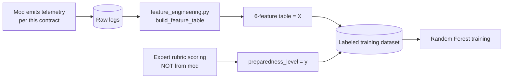

# BERONG SMP — Telemetry Contract

**Version:** 1.1 (draft)
**Owner:** AI/ML Engineer (MiDRR-Classifier)
**Implementer:** Mod/Server team (BERONG_SMP)
**Status:** Proposed — fields below are what the ML pipeline *requires*; several do not exist in the mod yet (see §7).

This document defines the exact data the Minecraft mod must emit so the MiDRR-Classifier can compute its features and train the preparedness model. It is the single source of truth for the mod↔ML boundary. If a field changes here, bump the version and notify both sides.

> **Important:** This telemetry is **not** the training dataset. It is the raw input. The ML pipeline turns these logs into engineered features, and labels are attached separately during expert scoring. The mod never emits `preparedness_level`.

### Changes since v1.0 (driven by the BFP-validated LSPU evacuation plan)
- **New event `fire_alarm_activate`** — the BFP COMMUNICATE step explicitly requires pressing the fire alarm. Without this event, that behavior is invisible to the model and the rubric.
- **New event `assembly_area_reached`** — true evacuation success is reaching the assembly area, **not** merely touching an exit. `emergency_exit` is now a waypoint, not the success signal.
- **New field `nearby_player_count` on `extinguisher_use`** — the plan says *"DO NOT FIGHT FIRE IF ALONE."* Using an extinguisher alone is *incorrect* behavior, so the model/rubric must know whether the player was alone at that moment.
- **New §8 Map ground-truth metadata** — a one-time static description of the simulated building (designated exits, assembly areas, extinguisher/alarm positions) so features like `path_efficiency_ratio` measure against the *real* designated routes.

---

## 1. What the data is used for (why each side should care)



Every required field below maps to at least one model feature or rubric dimension. If the mod cannot emit a field, the dependent feature/score is uncomputable.

---

## 2. Scope, units, and conventions

| Convention | Value |
|---|---|
| Coordinate frame | Minecraft world coordinates. **X, Z = horizontal plane; Y = vertical (height).** |
| Distance unit | Minecraft blocks (1 block = 1 meter, treat as float) |
| Time anchor | `t = 0.0` is the **disaster trigger tick** (the moment the fire/earthquake starts), **not** world join. Pre-trigger samples may be logged with negative `t` or omitted — see §6. |
| Time unit | Seconds since trigger, float. Minecraft runs at 20 ticks/sec, so `seconds = tick_count / 20.0`. |
| Sampling rate (movement) | **20 Hz** (every tick — matches Minecraft's native tick rate). This is the required rate for real-time analysis. Do not go below 5 Hz for batch-only use cases. |
| Events | Logged the instant they happen (not sampled). |
| `scenario_type` casing | Emit lowercase `fire` / `earthquake`. (Mod enum `FIRE`/`EARTHQUAKE` → lowercase on export.) |
| Player identity | Emit a stable `player_id` (UUID or pseudonymized ID). One value per student for the whole study so labels and sessions join correctly. |
| Character encoding | UTF-8, no BOM. |

---

## 3. Canonical batch format (recommended for the thesis)

One **long-format CSV per data-collection batch**, one row per logged sample **or** event. This matches `MiDRR-Classifier/src/midrr_classifier/data_schema.RAW_LOG_SCHEMA` and feeds `build_feature_table()` directly (grouped by `player_id` × `scenario_type`).

**File:** `gameplay_logs_<batch>_<YYYYMMDD>.csv`

| Column | Type | Required | Description | Example |
|---|---|---|---|---|
| `player_id` | string | ✅ | Stable per-student identifier | `stu_0412` |
| `session_id` | string | ✅ | Unique per run (one student can have multiple runs) | `sess_a91f` |
| `scenario_type` | string | ✅ | `fire` or `earthquake` | `fire` |
| `timestamp` | float | ✅ | Seconds since disaster trigger (`t=0` at trigger) | `12.40` |
| `event_type` | string | ✅ | See §4 vocabulary | `move` |
| `x` | float | ✅ on `move` | Horizontal X | `124.5` |
| `y` | float | ✅ on `move` | Vertical (height) | `64.0` |
| `z` | float | ✅ on `move` | Horizontal Z | `-88.2` |
| `hazard_distance` | float | ✅ on `move`/`hazard_proximity` | Distance (blocks) to **nearest active hazard** at that instant | `7.30` |
| `interaction_target` | string | optional | What was interacted with, for context | `extinguisher_03` |
| `nearby_player_count` | int | ✅ on `extinguisher_use` | Other players within ~5 blocks / same room at the event (for the "do not fight fire if alone" rule) | `0` |

> **Movement rows carry `hazard_distance`.** The cheapest implementation: on every sampled `move` row, also compute and attach the current nearest-hazard distance. Then you don't need separate `hazard_proximity` rows at all (keep that event_type optional).

`preparedness_level` is **deliberately absent** — it is joined in later from the labeling spreadsheet, keyed on `session_id`. `nearby_player_count` is only required on `extinguisher_use` rows; leave blank elsewhere.

---

## 4. `event_type` vocabulary

| `event_type` | When emitted | Carries coords? | Carries `hazard_distance`? | Feeds feature / rubric |
|---|---|---|---|---|
| `session_start` | At disaster trigger (`t=0`) | player spawn pos | yes | anchor for `evacuation_time`, `decision_delay` |
| `move` | Every sample tick while in scenario | ✅ | ✅ | `path_efficiency_ratio`, `panic_proxy`, `evacuation_time` |
| `hazard_proximity` | (optional) when crossing a danger threshold | optional | ✅ | `hazard_avoidance_ratio` (rubric F1/E2) |
| `fire_alarm_activate` | Player presses the fire alarm switch | ✅ at event | ✅ | `interaction_frequency`, `decision_delay`; **rubric F2 (COMMUNICATE)** |
| `door_open` | Player opens a door | ✅ at event | ✅ | `interaction_frequency`, `decision_delay` |
| `extinguisher_use` | Player uses an extinguisher (fire) | ✅ at event | ✅ | `interaction_frequency`; **rubric F3 (needs `nearby_player_count`)** |
| `emergency_exit` | Player passes/uses a marked exit (**waypoint, not success**) | ✅ at event | ✅ | `decision_delay`, route checks |
| `assembly_area_reached` | Player arrives at a designated assembly area | ✅ at event | ✅ | **true evacuation success**; `evacuation_time` end; rubric F4/E4 |
| `session_end` | Run terminates (assembly reached, injury, timeout) | ✅ final pos | ✅ | outcome / `evacuation_time` cap |

**Rules to lock down with the mod team:**
- A run **must** start with exactly one `session_start` and end with exactly one `session_end`.
- **Success = `assembly_area_reached`**, not `emergency_exit`. A player can pass an exit and still fail to reach the assembly area; the rubric's critical-failure override depends on this distinction.
- "First valid action" (for `decision_delay`) = first `fire_alarm_activate` / `door_open` / `extinguisher_use` / `emergency_exit` after first hazard exposure. Confirm this set matches `INTERACTION_EVENT_TYPES` (which must now include `fire_alarm_activate`).
- "First hazard exposure" = first row where `hazard_distance < SAFE_HAZARD_DISTANCE` (currently `5.0` blocks — **to be calibrated**, §9).
- On `extinguisher_use`, always populate `nearby_player_count` (0 = alone).

---

## 5. Session metadata (emit once per run)

Even though the six current features are per-event, capture these per-session fields. They are needed for the **reduced fallback feature set** (§7) and for Chapter 3 / dashboard context. Emit as a sidecar `sessions_<batch>.csv` keyed on `session_id`, or as a header block.

| Field | Type | Source today? | Notes |
|---|---|---|---|
| `session_id` | string | — | join key |
| `player_id` | string | ✅ UUID | |
| `scenario_type` | string | ✅ | fire/earthquake |
| `started_at` / `ended_at` | ISO-8601 | ✅ | wall-clock |
| `duration_ticks` | int | ✅ | session length |
| `end_reason` | string | partial | `assembly_reached` / `injured` / `timeout` / `failed` |
| `fires_extinguished_count` | int | ✅ (fire) | fire only |
| `magnitude` | float | ✅ (quake) | earthquake only |
| `aftershock_count` | int | ✅ (quake) | earthquake only |
| `aftershock_magnitude_scale` | float | ✅ (quake) | earthquake only |
| `final_earthquake_phase` | string | ✅ (quake) | earthquake only |
| `mod_version` / `contract_version` | string | — | for reproducibility |

---

## 6. Real-time streaming format (Phase 7)

The mod samples at **20 Hz** (every Minecraft tick) and POSTs accumulated events to the API every **5 seconds** (~100 move rows per batch). The API maintains a per-session buffer, recomputes features on each batch, and returns a live prediction snapshot the dashboard displays in real time.

### 6a. Endpoint

```
POST /session/{session_id}/events
```

### 6b. Request body

```json
{
  "contract_version": "1.1",
  "session_id": "sess_a91f",
  "player_id": "stu_0412",
  "scenario_type": "fire",
  "events": [
    {"timestamp": 0.0,  "event_type": "session_start", "x": 100.0, "y": 64.0, "z": -80.0, "hazard_distance": 18.0},
    {"timestamp": 0.05, "event_type": "move",          "x": 100.2, "y": 64.0, "z": -80.1, "hazard_distance": 17.8},
    {"timestamp": 0.10, "event_type": "move",          "x": 100.4, "y": 64.0, "z": -80.3, "hazard_distance": 17.6},
    {"timestamp": 2.1,  "event_type": "fire_alarm_activate", "x": 101.0, "y": 64.0, "z": -80.5, "hazard_distance": 16.9},
    {"timestamp": 3.1,  "event_type": "extinguisher_use", "x": 104.0, "y": 64.0, "z": -82.0, "hazard_distance": 4.2, "nearby_player_count": 0}
  ]
}
```

- Send **only new events** since the last POST — the API accumulates them internally.
- The `session_start` event must be in the **first batch** only.
- The `session_end` event must be in the **final batch**; the API closes the buffer after receiving it.
- POST interval: every **5 seconds** (configurable). Lower = smoother dashboard; higher = fewer requests. Do not exceed 1 second — the server is single-process for the thesis demo.

### 6c. Response

```json
{
  "session_id": "sess_a91f",
  "player_id": "stu_0412",
  "scenario_type": "fire",
  "elapsed_time": 5.0,
  "event_count": 102,
  "is_complete": false,
  "features": {
    "evacuation_time": 5.0,
    "decision_delay": 0.0,
    "path_efficiency_ratio": 0.72,
    "hazard_avoidance_ratio": 0.91,
    "interaction_frequency": 0.04,
    "panic_proxy": 12.3
  },
  "prediction": "HIGH",
  "prep_score": 78.4
}
```

- `prediction` is `null` until a trained model is loaded on the server.
- `prep_score` is the winning class probability scaled to 0–100.
- `is_complete` becomes `true` once `assembly_area_reached` is received; the dashboard can then show the final result.
- Features computed on **partial data** are meaningful: e.g. `hazard_avoidance_ratio` is the fraction of ticks at safe distance *so far*, not the final value.

### 6d. Session lifecycle

```
POST /session/{id}/events   ← first batch (contains session_start)
POST /session/{id}/events   ← subsequent batches (5 s intervals)
...
POST /session/{id}/events   ← final batch (contains session_end)
DELETE /session/{id}        ← optional explicit cleanup (API auto-closes on session_end)
```

---

## 7. Gap analysis — what exists vs. what's needed

Per `BERONG_SMP_WEB/CLAUDE.md`, the mod today emits **session-level data only**. The per-tick stream and new events below are **new instrumentation** the mod team must build:

| Required for full feature set / rubric | Exists today? | Action |
|---|---|---|
| Per-tick `move` samples (`x,y,z`, `t`) | ❌ | **Build:** tick sampler writing position every N ticks |
| Running `hazard_distance` per sample | ❌ | **Build:** nearest-active-hazard distance each sample |
| `fire_alarm_activate` event | ❌ | **Build:** emit on alarm-switch interaction (rubric F2) |
| `assembly_area_reached` event | ❌ | **Build:** emit on entering a designated assembly zone (success signal) |
| `nearby_player_count` on `extinguisher_use` | ❌ | **Build:** count nearby players at event (rubric F3) |
| Timestamped `door_open` / `extinguisher_use` / `emergency_exit` | partial | **Build/confirm:** emit with `t` and coords |
| `session_start` at trigger / `session_end` with reason | partial | **Confirm:** explicit trigger anchor + end reason |
| Session metadata (§5) | ✅ mostly | reuse existing fields |

**Fallback if per-tick logging can't be delivered in time:** a *reduced* model trained only on session-level fields (`duration`, `end_reason`, `fires_extinguished_count`, `magnitude`, `aftershock_count`). Weaker and not what Chapters 1/3 promise, but it keeps the project shippable. Treat this as a contingency, not the plan.

---

## 8. Map ground-truth metadata (one-time static file, not per-session)

Several features and rubric checks measure behavior against the **designated** layout, so the mod team must provide a one-time static description of the simulated building, derived from the LSPU Sta. Cruz floor plan. Emit once as `map_metadata.json` per scenario map.

| Element | Why |
|---|---|
| Designated **exit** coordinates (per exit) | `path_efficiency_ratio` and route correctness measure against the *nearest designated* exit, not a generic straight line |
| **Assembly area** zone coordinates / bounds | defines when `assembly_area_reached` fires; the real success target |
| **Fire alarm switch** positions | validates `fire_alarm_activate` location plausibility |
| **Extinguisher** positions | context for `extinguisher_use` |
| Hazard spawn zones (fire origin / quake debris areas) | reproducibility of `hazard_distance`; defines the earthquake "hazard" set |

> The Minecraft map should replicate the LSPU Sta. Cruz Administration Building ground floor (exits, extinguisher + alarm positions, assembly areas) so logged behavior corresponds to the BFP-validated real-world layout.

---

## 9. Open questions to resolve with the team

1. **`SAFE_HAZARD_DISTANCE`** — confirm the block threshold for "in danger." Currently `5.0`; calibrate with BFP/teacher input. Fire and earthquake may need different values.
2. **`path_efficiency_ratio` denominator** — straight-line over **horizontal (X,Z)** distance only, or full 3D? Recommend horizontal, since evacuation is a floor-plan problem. Measure to nearest **designated** exit (§8).
3. **`nearby_player_count` definition** — radius in blocks, or same-room? Pick one and document it.
4. **Multiple runs per student** — allowed? If yes, decide whether each `session_id` is an independent training row (watch for `player_id` leakage across train/test).
5. **Timeout cap** — the scenario time limit, so `evacuation_time` for non-arrivers is capped consistently.
6. **Earthquake "hazard"** — what is `hazard_distance` measured to? Falling debris? Unsafe structures? Define the hazard object set for quakes (§8).
7. **Sampling rate** — confirm 10 Hz is acceptable for performance with N students concurrently.
8. **Label join** — confirm `session_id` is the key linking telemetry to the expert-rubric labels.

---

## 10. Validation checklist (mod team self-check before sending data)

- [ ] Every row has `player_id`, `session_id`, `scenario_type`, `timestamp`, `event_type`.
- [ ] `scenario_type` is lowercase `fire`/`earthquake`.
- [ ] Exactly one `session_start` (`t≈0`) and one `session_end` per `session_id`.
- [ ] `move` rows include `x,y,z` and `hazard_distance`.
- [ ] `extinguisher_use` rows include `nearby_player_count`.
- [ ] Successful runs include an `assembly_area_reached` event before `session_end`.
- [ ] `fire_alarm_activate` emitted when the alarm is pressed.
- [ ] `timestamp` is seconds-since-trigger, monotonically non-decreasing within a session.
- [ ] No `preparedness_level` column (labels are added later).
- [ ] `contract_version` recorded as `1.1`.
- [ ] `map_metadata.json` provided once per scenario map (§8).
- [ ] A 1-session sample sent to the ML side and confirmed to pass `validate_raw_schema()` **before** a full batch.

---

*Contract v1.1 — derived from `MiDRR-Classifier/data_schema.py`, the BERONG_SMP_WEB integration notes, and the BFP-validated LSPU Sta. Cruz evacuation plan. Pair with `labeling_rubric.md`. Update version on any field change.*
